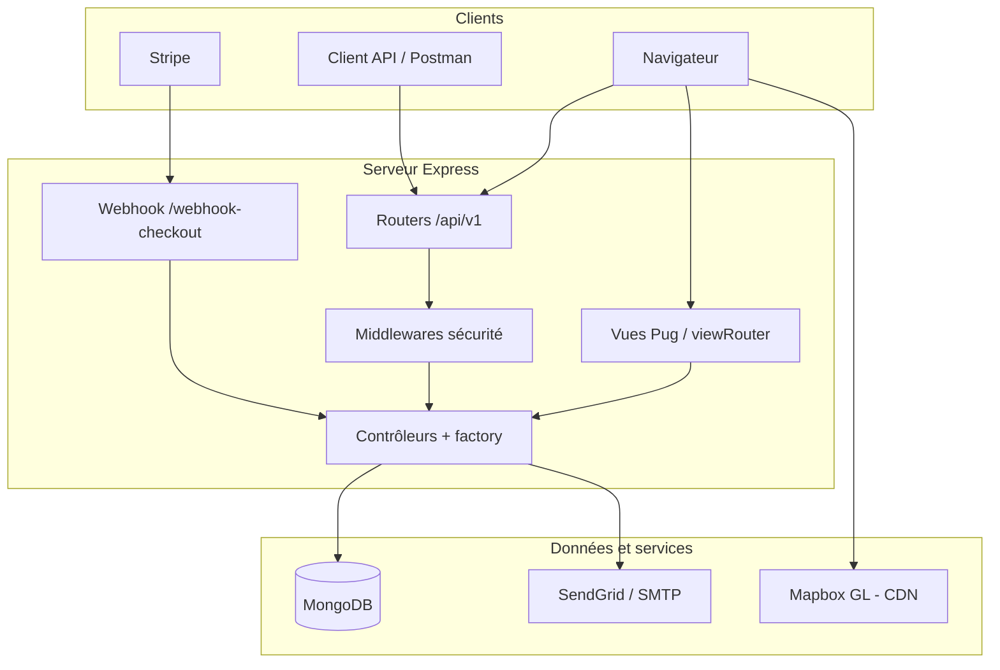
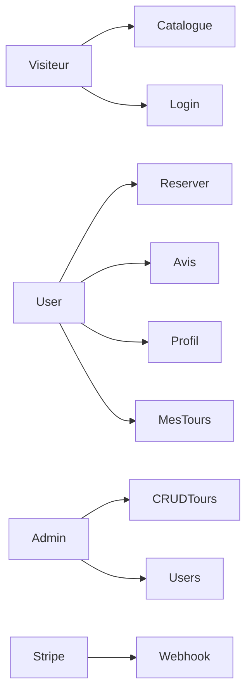
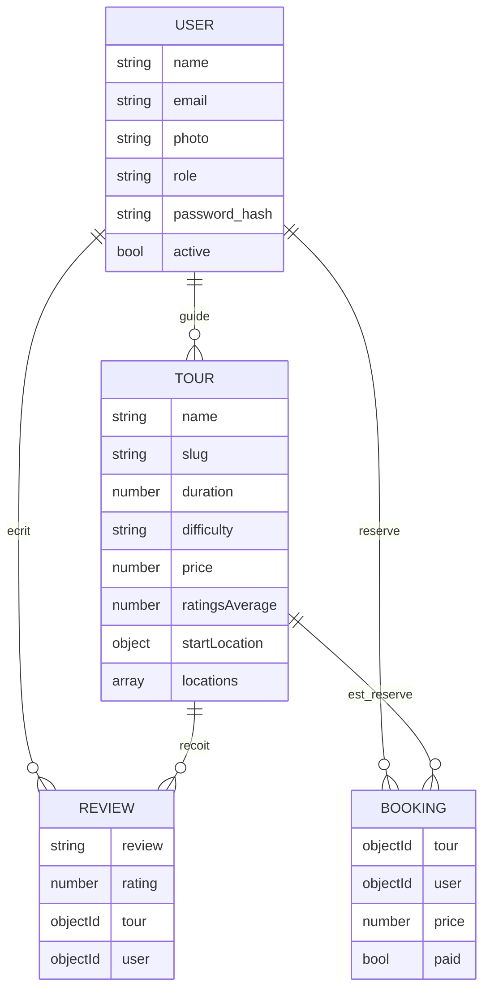
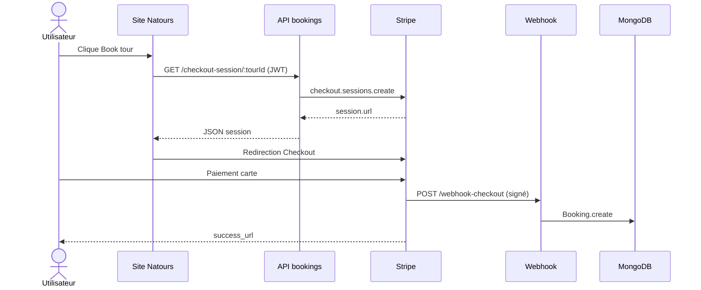

<p align="center">
<<<<<<< HEAD
  
</p>

<p align="center">
=======
>>>>>>> 078f35190d70a186abc3903975c3f1609c98e1a2
  
</p>

<h1 align="center">Connect With Nature</h1>

<p align="center">
  <strong>Exciting tours for adventurous people</strong>
</p>

<p align="center">
  Découvrez des lieux sauvages. Suivez des guides experts. Revenez avec des souvenirs — pas avec un objet de boutique.
</p>

<p align="center">
  <a href="#1-présentation-académique-du-projet"><strong>Fiche PFE</strong></a>
  ·
  <a href="#4-cahier-des-charges">Cahier des charges</a>
  ·
  <a href="#5-conception">Conception</a>
  ·
  <a href="#8-installation-et-exploitation">Installation</a>
  ·
  <a href="#11-guide-de-soutenance">Soutenance</a>
</p>

---

<table>
  <tr>
    <td align="center" width="33%">
      <strong>L’aventure, pas une checklist</strong><br>
      Circuits de plusieurs jours, positions réelles sur la carte — du premier sentier au dernier camp.
    </td>
    <td align="center" width="33%">
      <strong>Des personnes de confiance</strong><br>
      Noté par les voyageurs. Mené par des guides. Réservé en quelques minutes, paiement sécurisé.
    </td>
    <td align="center" width="33%">
      <strong>Votre voyage, votre compte</strong><br>
      Inscription, profil, avis sur les lieux visités, et consultation des circuits déjà réservés.
    </td>
  </tr>
</table>

<p align="center">
  <em>Qu’attendez-vous ? Une aventure. Des souvenirs infinis. Faites-la vôtre dès aujourd’hui.</em>
</p>

---

# Natours — plateforme web de réservation de circuits nature

**Document d’accompagnement du Projet de Fin d’Études (PFE)**  
Application web full-stack : site rendu côté serveur + API REST, paiements en ligne, cartographie et sécurité applicative.

> Ce README est rédigé pour servir de **socle au rapport écrit** et de **fil conducteur à la soutenance**. Les champs entre crochets (`[…]`) sont à compléter avec les informations de l’établissement.

---

## Table des matières

1. [Présentation académique du projet](#1-présentation-académique-du-projet)
2. [Résumé / Abstract](#2-résumé--abstract)
3. [Introduction, contexte et problématique](#3-introduction-contexte-et-problématique)
4. [Cahier des charges](#4-cahier-des-charges)
5. [Conception](#5-conception)
6. [Réalisation technique](#6-réalisation-technique)
7. [Sécurité, qualité et gestion des erreurs](#7-sécurité-qualité-et-gestion-des-erreurs)
8. [Installation et exploitation](#8-installation-et-exploitation)
9. [Tests, limites et perspectives](#9-tests-limites-et-perspectives)
10. [Conclusion](#10-conclusion)
11. [Guide de soutenance](#11-guide-de-soutenance)
12. [Bibliographie indicative](#12-bibliographie-indicative)
13. [Licence](#13-licence)

---

## 1. Présentation académique du projet

| Rubrique | Contenu |
| --- | --- |
| **Intitulé proposé** | Conception et réalisation d’une plateforme web de réservation de circuits touristiques nature (Natours) |
| **Type de projet** | Projet de Fin d’Études — application web |
| **Domaine** | Génie logiciel, applications web, bases de données, cybersécurité applicative, intégration de services tiers |
| **Auteur** | Oussama Ennadafy |
| **Dépôt** | [github.com/oussamaennadafy/natours](https://github.com/oussamaennadafy/natours) |
| **Établissement / Filière** | `[Nom de l’école ou faculté]` — `[Filière, ex. Génie Informatique]` |
| **Encadrant pédagogique** | `[Nom et grade]` |
| **Année universitaire** | `[2025–2026]` |
| **Mots-clés** | Node.js, Express, MongoDB, REST, JWT, RBAC, Stripe, Mapbox, Pug, sécurité web |

### 1.1 Objectif pédagogique

Le projet vise à démontrer la capacité à **analyser un besoin**, **concevoir une architecture**, **implémenter un système complet** (front rendu serveur + API), **intégrer des services externes** (paiement, e-mail, cartes) et **justifier les choix techniques** devant un jury.

### 1.2 Livrables attendus (alignement PFE)

| Livrable | Où le trouver dans ce dépôt |
| --- | --- |
| Application fonctionnelle | `server.js`, `app.js`, `views/`, `public/` |
| API documentée | [section 6.4](#64-spécification-de-lapi-rest) |
| Modèle de données | [section 5.4](#54-modèle-de-données) |
| Cahier des charges | [section 4](#4-cahier-des-charges) |
| Architecture | [section 5.1](#51-architecture-globale) |
| Aspects sécurité | [section 7](#7-sécurité-qualité-et-gestion-des-erreurs) |
| Guide d’installation | [section 8](#8-installation-et-exploitation) |

### 1.3 Correspondance avec un plan de rapport type

| Chapitre du mémoire | Section de ce README |
| --- | --- |
| Page de garde, remerciements, listes | Fiche §1 + à rédiger dans Word/LaTeX |
| Introduction générale | §3 |
| Étude de l’existant et problématique | §3.2–3.4 |
| Spécification des besoins | §4 |
| Conception (architecture, UML, MCD) | §5 |
| Implémentation | §6 |
| Tests, sécurité, déploiement | §7–9 |
| Conclusion et perspectives | §9–10 |
| Annexes (API, variables d’environnement) | §6.4 et §8 |

---

## 2. Résumé / Abstract

### Résumé (FR)

Natours est une **application web de réservation de circuits nature**. Elle expose d’une part un **site web** (templates Pug) permettant de consulter les circuits, de s’authentifier, de gérer son profil et de payer une réservation, et d’autre part une **API REST versionnée** (`/api/v1`) destinée aux opérations CRUD, aux recherches géospatiales et à l’administration. L’authentification repose sur des **JWT** stockés en cookie HTTP-only, les droits sont gérés par **rôles** (utilisateur, guide, lead-guide, administrateur), les paiements transitent par **Stripe Checkout** et sont confirmés par **webhook**. Les avis recalculent automatiquement la note moyenne d’un circuit. Le projet illustre une architecture **MVC**, un **factory pattern** pour le CRUD, des middlewares de **sécurité** (Helmet, limitation de débit, sanitization NoSQL/XSS, HPP) et l’intégration de **MongoDB** (schémas Mongoose, index 2dsphere, agrégations).

### Abstract (EN)

Natours is a nature-tour booking web application. It provides a server-rendered website and a versioned REST API. Users browse tours, authenticate with JWT cookies, manage their profile, post reviews, and pay with Stripe Checkout; webhooks persist bookings after payment. The work demonstrates MVC architecture, role-based access control, geospatial queries, image processing, and common web-security controls suitable for an undergraduate capstone (PFE) defense.

---

## 3. Introduction, contexte et problématique

### 3.1 Contexte

Le tourisme d’aventure (randonnées, circuits multi-jours, groupes encadrés) s’appuie de plus en plus sur des **plateformes numériques** : catalogue, avis, paiement en ligne, compte client. Une agence ou un opérateur a besoin :

- d’un **catalogue** riche (durée, difficulté, dates, lieux, guides) ;
- d’une **réservation fiable** (paiement, confirmation, historique) ;
- d’une **confiance** (avis, notes, comptes nominatifs) ;
- d’outils **métier** (statistiques, planning mensuel, gestion des circuits).

Natours simule ce système de bout en bout, dans un périmètre académique réaliste.

### 3.2 Problématique

> **Comment concevoir et réaliser une plateforme web sécurisée permettant de consulter, noter et réserver des circuits nature, tout en offrant une API réutilisable et des fonctions d’administration, dans le respect des contraintes d’un projet de fin d’études ?**

Sous-questions (utiles à l’oral) :

1. Comment séparer **interface humaine** (HTML rendu) et **interface machine** (JSON) sur le même serveur ?
2. Comment **authentifier** et **autoriser** sans exposer les secrets (mots de passe, clés Stripe) ?
3. Comment **garantir l’intégrité du paiement** (le client ne doit pas créer une réservation « payée » tout seul) ?
4. Comment interroger des circuits **par proximité géographique** ?
5. Comment **industrialiser** le CRUD sans dupliquer le code ?

### 3.3 Étude de l’existant (positionnement)

| Approche | Intérêt | Limite vis-à-vis du PFE |
| --- | --- | --- |
| Site vitrine statique | Simple | Pas de réservation ni de comptes |
| CMS (WordPress + plugin) | Rapide | Peu de maîtrise du code, difficile à justifier en génie logiciel |
| SPA (React) + API séparée | Moderne | Périmètre plus lourd ; ici le rendu serveur Pug suffit au besoin métier |
| **Natours (ce projet)** | Un seul backend Express, vues + API, paiements, geo, sécurité | Périmètre volontairement pédagogique ; pas d’app mobile native |

Le projet s’inspire du parcours pédagogique Node.js de Jonas Schmedtmann, **réimplémenté et adapté** (Express 5, Mongoose 8, Node 22, Stripe Checkout actuel). En soutenance, présenter clairement : **ce qui vient du cours / ce qui a été compris, modifié et justifié**.

### 3.4 Objectifs du projet

**Objectif général :** livrer une plateforme opérationnelle de consultation et de réservation de circuits.

**Objectifs spécifiques :**

1. Modéliser le domaine (Tour, User, Review, Booking) dans MongoDB.
2. Exposer une API REST filtrable, paginée et géospatiale.
3. Rendre un site consultable (liste, fiche circuit, carte, compte).
4. Mettre en œuvre authentification JWT, reset mot de passe par e-mail, RBAC.
5. Enchaîner paiement Stripe → webhook → création de réservation.
6. Appliquer des mesures de sécurité HTTP et de durcissement des entrées.
7. Documenter le système pour un rapport et une démonstration orale.

---

## 4. Cahier des charges

### 4.1 Acteurs

| Acteur | Description |
| --- | --- |
| **Visiteur** | Consulte le catalogue et les fiches ; peut ouvrir le formulaire de connexion |
| **Utilisateur authentifié (`user`)** | Réserve, gère son profil, dépose un avis, voit « mes circuits » |
| **Guide (`guide`)** | Accès au planning mensuel (API) |
| **Lead-guide (`lead-guide` / `lead-guid` dans le schéma)** | CRUD circuits et réservations (avec admin) |
| **Administrateur (`admin`)** | Gestion utilisateurs, avis, circuits, réservations |
| **Stripe** | Acteur système : sessions Checkout et webhooks |
| **Service e-mail** | Mailtrap (dev) ou SendGrid (prod) |

> **Note de rapport :** le enum Mongoose utilise `lead-guid` (faute d’orthographe) alors que les middlewares `restrictTo` attendent souvent `lead-guide`. C’est un point **honnête** à citer en limites / correctifs.

### 4.2 Besoins fonctionnels

| ID | Besoin | Priorité | Acteur |
| --- | --- | --- | --- |
| BF01 | Consulter la liste des circuits (nom, prix, note, résumé, dates) | Must | Visiteur |
| BF02 | Consulter le détail d’un circuit (itinéraire, guides, avis, carte) | Must | Visiteur |
| BF03 | S’inscrire et se connecter / se déconnecter | Must | Visiteur / User |
| BF04 | Mettre à jour nom, e-mail, photo de profil | Must | User |
| BF05 | Changer le mot de passe (connecté) | Must | User |
| BF06 | Réinitialiser le mot de passe par e-mail (jeton à durée limitée) | Must | Visiteur |
| BF07 | Réserver un circuit via paiement carte (Stripe) | Must | User |
| BF08 | Consulter les circuits déjà réservés | Must | User |
| BF09 | Déposer / modifier / supprimer un avis (un avis par couple user–tour) | Must | User |
| BF10 | Recalculer note moyenne et nombre d’avis du circuit | Must | Système |
| BF11 | CRUD circuits (images cover + galerie) | Must | Admin / lead-guide |
| BF12 | Filtrer, trier, paginer, projeter les champs (API) | Must | Client API |
| BF13 | Rechercher les circuits dans un rayon autour d’un point | Should | Client API |
| BF14 | Calculer les distances depuis un point | Should | Client API |
| BF15 | Statistiques d’agrégation (difficulté, prix, notes) | Should | Client API |
| BF16 | Planning mensuel des départs pour une année | Should | Guide / admin |
| BF17 | Alias « top 5 pas chers / bien notés » | Could | Client API |
| BF18 | Désactivation de compte (soft delete `active: false`) | Should | User |
| BF19 | Administration des utilisateurs et des réservations | Must | Admin / lead-guide |

### 4.3 Besoins non fonctionnels

| ID | Catégorie | Exigence |
| --- | --- | --- |
| BNF01 | **Sécurité** | Mots de passe hachés (bcrypt, cost 12) ; JWT secret hors dépôt ; cookies HTTP-only |
| BNF02 | **Sécurité** | Limitation de débit API (100 req / IP / heure) |
| BNF03 | **Sécurité** | En-têtes HTTP (Helmet), CSP adaptée aux CDN Mapbox/Stripe |
| BNF04 | **Sécurité** | Sanitization NoSQL et XSS ; protection HPP (whitelist métier) |
| BNF05 | **Confidentialité** | Ne pas logger les secrets ; `config.env` gitignoré |
| BNF06 | **Intégrité paiement** | Création de booking côté serveur après événement Stripe signé |
| BNF07 | **Performance** | Compression gzip ; index MongoDB (prix+note, slug, 2dsphere) |
| BNF08 | **Maintenabilité** | Architecture MVC, factory CRUD, `catchAsync`, erreurs centralisées |
| BNF09 | **Portabilité** | Node.js 22 ; variables d’environnement |
| BNF10 | **Disponibilité (prod)** | Arrêt propre sur `SIGTERM` / rejets de promesses |
| BNF11 | **UX** | Pages Pug, messages d’alerte, e-mails HTML + texte |
| BNF12 | **Interopérabilité** | API JSON REST, CORS, webhook HTTP |

### 4.4 Contraintes

- Stack imposée / choisie : **JavaScript côté serveur** (Node.js), pas de framework front SPA obligatoire.
- Base **NoSQL documentaire** (MongoDB) plutôt qu’un SGBDR, pour les documents riches (tableaux de lieux, dates, images).
- Services tiers : **Stripe**, **Mapbox**, **SMTP / SendGrid**.
- Délai et effectif d’un PFE individuel : périmètre volontairement borné (pas de back-office React séparé, pas d’app iOS/Android).

### 4.5 Règles métier importantes

1. Un utilisateur **ne peut pas** poster mot de passe sur `/updateMe` (route dédiée `updatePassword`).
2. Index unique `{ tour, user }` sur Review : **un avis par utilisateur et par circuit**.
3. Les circuits `secretTour: true` sont exclus des `find`.
4. Les utilisateurs `active: false` sont exclus des `find`.
5. Le webhook Stripe est monté **avant** `express.json()`, avec `express.raw`, pour la signature.

---

## 5. Conception

### 5.1 Architecture globale

Le système suit une architecture **trois-tiers logique** sur un **monolithe modulaire** Express :

1. **Présentation** — Pug + CSS/JS statiques (`public/`).
2. **Application** — routes, middlewares, contrôleurs, services (e-mail, Stripe).
3. **Persistance** — MongoDB via Mongoose.



**Choix architectural (à justifier à l’oral) :** un seul processus Node simplifie le déploiement PFE. L’API et le site partagent authentification, modèles et règles métier. Le rendu serveur évite une SPA tout en restant démontrable.

### 5.2 Architecture logicielle (MVC + middlewares)

| Couche | Fichiers | Rôle |
| --- | --- | --- |
| Entrée | `server.js` | Config, connexion DB, listen, handlers processus |
| Composition | `app.js` | Middlewares globaux, montage des routers |
| Routes | `routes/*` | Verbes HTTP, `protect`, `restrictTo` |
| Contrôleurs | `controllers/*` | Cas d’utilisation |
| Modèles | `models/*` | Schémas, hooks, méthodes d’instance |
| Utilitaires | `utils/*` | `ApiFeatures`, `AppError`, `Email`, `catchAsync` |
| Vues | `views/*.pug` | HTML métier et e-mails |

**Patron factory** (`handlerFactory.js`) : `createOne`, `getOne`, `getAll`, `updateOne`, `deleteOne` factorisent le CRUD. Intérêt PFE : **DRY**, testabilité, homogénéité des réponses.

**Patron chaîne de responsabilité** : middlewares Express (`protect` → `restrictTo` → handler).

### 5.3 Diagramme de cas d’utilisation (vue simplifiée)



En rapport, détailler en UML officiel : *Consulter catalogue*, *S’authentifier*, *Réserver circuit*, *Payer*, *Noter circuit*, *Gérer circuits*, etc., avec include/extend (paiement include authentification).

### 5.4 Modèle de données

MongoDB est **document-oriented**. Les relations sont des **références ObjectId** (et un virtual `reviews` sur Tour), pas un schéma relationnel 3NF. En soutenance : expliquer **dénormalisation contrôlée** (`ratingsAverage` / `ratingsQuantity` recopiés sur Tour).



#### Tour

- Attributs métier : nom unique, durée, taille de groupe, difficulté (`easy` | `medium` | `hard` | `difficult`), prix, remise (validateur : remise &lt; prix), résumé, description, images, dates de départ.
- **GeoJSON** `Point` : `startLocation` et `locations[]` (jour, description).
- **Index** : composé `price` + `ratingsAverage`, `slug`, `2dsphere` sur `startLocation`.
- **Virtuals** : `durationWeeks`, `reviews` (populate).
- **Hook** `pre('save')` : `slugify` du nom.
- Guides : tableau de références User.

#### User

- E-mail unique validé, mot de passe min. 8 caractères (intention du schéma), `passwordConfirm` uniquement à la création (`save`).
- Rôles : `user`, `guide`, `lead-guid`, `admin`.
- Reset : `passwordResetToken` (hashé) + expiration.
- Soft delete : `active`.

#### Review

- Note 1–5, texte obligatoire.
- Hook `post('save')` et `findOneAnd*` : `calcAverageRatings` (pipeline `$group`).

#### Booking

- Prix figé au moment de l’achat (copie depuis Stripe `amount_total`).
- `paid` par défaut `true` après checkout réussi.

### 5.5 Scénario de séquence : réservation



**Point de conception :** on ne fait **pas** confiance à un `?paid=true` dans l’URL. La source de vérité est l’événement `checkout.session.completed` vérifié avec `STRIPE_WEBHOOK_SECRET`.

### 5.6 Authentification et autorisation

- **JWT** signé avec `JWT_SECRET`, claim `id` utilisateur, durée `JWT_EXPIRES_IN`.
- Cookie `jwt` : `httpOnly`, `secure` si HTTPS ou `x-forwarded-proto`.
- Alternative : en-tête `Authorization: Bearer <token>` (clients API).
- `protect` : vérifie token, charge l’utilisateur, refuse si mot de passe changé après émission du token.
- `restrictTo(...roles)` : RBAC.
- `isLogedIn` : hydrate `res.locals.user` pour le header Pug sans bloquer les pages publiques.

### 5.7 Conception de l’API de requête (`ApiFeatures`)

Classe enchaînable :

1. **filter** — copie la query string (qs), retire `page`, `sort`, `limit`, `fields`, transforme `gte`/`gt`/`lte`/`lt` en opérateurs Mongo `$gte` etc.
2. **sort** — sinon défaut `-createdAt`.
3. **limitFields** — projection ; sinon `-__v`.
4. **paginate** — `page` / `limit` (défaut 10).

Exemple pédagogique pour le rapport : exploser une URL en objet MongoDB.

---

## 6. Réalisation technique

### 6.1 Stack et justification

| Technologie | Rôle | Justification PFE |
| --- | --- | --- |
| **Node.js 22** | Runtime | JavaScript unifié, I/O non bloquant (HTTP, DB, e-mail) |
| **Express 5** | Framework HTTP | Middleware, routage, écosystème |
| **MongoDB + Mongoose 8** | Persistance | Documents riches, geo, agrégations |
| **Pug** | Templates | SSR simple, e-mails HTML |
| **JWT + bcryptjs** | Auth | Standard industrie, mots de passe non réversibles |
| **Stripe** | Paiement | PCI : la carte ne transite pas sur notre serveur |
| **Mapbox GL** | Carte | Itinéraire visuel sur la fiche circuit |
| **Multer + Sharp** | Images | Contrôle MIME, redimensionnement, JPEG |
| **Nodemailer** | E-mail | Welcome + reset password |
| **Helmet, rate-limit, hpp, xss-clean, mongo-sanitize** | Sécurité | Défense en profondeur |

### 6.2 Organisation du dépôt

```
natours/
├── server.js                 # Processus, dotenv, mongoose, listen
├── app.js                    # Express, sécurité, routers
├── controllers/              # Cas d’utilisation HTTP
│   ├── authController.js
│   ├── tourController.js     # CRUD, stats, geo, images
│   ├── userController.js     # Profil, photo, admin
│   ├── reviewController.js
│   ├── bookingController.js  # Checkout + webhook
│   ├── viewsController.js    # SSR
│   ├── handlerFactory.js
│   └── errorController.js
├── models/
├── routes/
├── views/                    # Pages + views/emails/
├── public/                   # css/, js/, img/
├── utils/
├── dev-data/data/            # Jeu de démo + import-dev-data.js
└── local.env                 # Gabarit (ne pas y mettre de secrets)
```

### 6.3 Flux HTTP principal (`app.js`)

Ordre **volontaire** (à commenter en soutenance) :

1. `trust proxy` — déploiements derrière reverse proxy.
2. CORS + `OPTIONS`.
3. Fichiers statiques `public/`.
4. Cookies, `urlencoded`.
5. Helmet.
6. Morgan si `development`.
7. Rate limiter sur `/api`.
8. **Webhook Stripe (body raw)**.
9. `express.json` (10 kb).
10. Shim `req.query` writable (compat Express 5 / xss + mongoSanitize).
11. xss-clean, mongoSanitize, hpp, compression.
12. Routers vues puis API.
13. 404 `/*splat` → `AppError`.
14. `globalErrorHandler`.

### 6.4 Spécification de l’API REST

**Base :** `/api/v1`  
**Format succès (typique) :** `{ "status": "success", "results": n, "data": { ... } }`  
**Auth :** cookie `jwt` ou `Authorization: Bearer`.

#### Auth — `/api/v1/auth`

| Méthode | Chemin | Accès | Corps / params | Effet |
| --- | --- | --- | --- | --- |
| POST | `/signup` | Public | `name`, `email`, `password`, `passwordConfirm` | Crée user, e-mail welcome, JWT |
| POST | `/login` | Public | `email`, `password` | JWT + cookie |
| GET | `/logout` | Public | — | Cookie vidé |
| POST | `/forgetPassword` | Public | `email` | E-mail de reset |
| PATCH | `/resetPassword/:token` | Public | nouveau mot de passe | Reset |
| PATCH | `/updatePassword` | Connecté | `passwordCurrent`, `password`, `passwordConfirm` | Nouveau JWT |

#### Tours — `/api/v1/tours`

| Méthode | Chemin | Accès |
| --- | --- | --- |
| GET | `/` | Public — liste + query |
| GET | `/top-5-cheap` | Public — alias |
| GET | `/tour-stats` | Public — agrégation |
| GET | `/monthly-plan/:year` | `admin`, `lead-guide`, `guide` |
| GET | `/tours-within/:distance/center/:latlng/unit/:unit` | Public |
| GET | `/distances/:latlng/unit/:unit` | Public |
| POST | `/` | `admin`, `lead-guide` |
| GET | `/:id` | Public — populate reviews |
| PATCH | `/:id` | `admin`, `lead-guide` + upload images |
| DELETE | `/:id` | `admin`, `lead-guide` |

Avis **imbriqués** (pas de mount `/api/v1/reviews`) :

- `GET|POST /api/v1/tours/:tour/reviews`
- `GET|PATCH|DELETE /api/v1/tours/:tour/reviews/:id`

`POST` avis : rôle `user` ; `PATCH`/`DELETE` : `user` ou `admin`.

**Exemples de requêtes**

```http
GET /api/v1/tours?duration[gte]=5&difficulty=easy&sort=-price&fields=name,price,duration&page=1&limit=10
GET /api/v1/tours/tours-within/233/center/34.111745,-118.113491/unit/mi
GET /api/v1/tours/distances/34.111745,-118.113491/unit/mi
```

Unités geo : `mi` (miles) ou, sinon, kilomètres (rayon terrestre 6378,1 km / 3962,2 mi).

#### Users — `/api/v1/users`

Toutes les routes exigent `protect`.

| Méthode | Chemin | Accès | Description |
| --- | --- | --- | --- |
| GET | `/me` | Connecté | Utilisateur courant |
| PATCH | `/updateMe` | Connecté | `name`, `email`, fichier `photo` |
| DELETE | `/deleteMe` | Connecté | Soft delete |
| GET | `/` | `admin` | Liste |
| DELETE | `/:id` | `admin` | Suppression |

Photo utilisateur : Sharp 500×500 JPEG qualité 90.  
Photos circuit : cover + jusqu’à 3 images, 2000×1333 JPEG.

#### Bookings — `/api/v1/bookings`

| Méthode | Chemin | Accès |
| --- | --- | --- |
| GET | `/checkout-session/:tourId` | Connecté |
| GET/POST | `/` | `admin`, `lead-guide` |
| GET/PATCH/DELETE | `/:id` | `admin`, `lead-guide` |

#### Webhook

```http
POST /webhook-checkout
```

Hors préfixe `/api/v1`. Vérification `stripe.webhooks.constructEvent`. Si `checkout.session.completed` : booking (tour = `client_reference_id`, user = e-mail Stripe, prix = `amount_total / 100`).

### 6.5 Site web (SSR)

| Méthode | Chemin | Auth | Vue |
| --- | --- | --- | --- |
| GET | `/` | Optionnelle (`isLogedIn`) | `overview` |
| GET | `/tour/:slug` | Optionnelle | `tour` + Mapbox |
| GET | `/login` | — | `login` |
| GET | `/me` | `protect` | `account` |
| GET | `/my-tours` | `protect` | `overview` filtré bookings |
| PATCH | `/submit-user-data` | `protect` | MAJ nom/e-mail formulaire |

JS client (`public/js/`) : login/logout, settings, mot de passe, bouton Stripe.

**Écart à documenter :** `success_url` Stripe pointe vers `/my-tour?alert=booking` alors que la route site est `/my-tours`. Utile en soutenance (dette / correctif).

### 6.6 Traitement asynchrone et erreurs

- `catchAsync` enveloppe les contrôleurs async pour `next(err)`.
- `AppError` : erreurs opérationnelles vs bugs.
- Dev : stack + objet erreur (API) ou page `error.pug`.
- Prod : messages génériques si erreur non opérationnelle ; mapping CastError, duplicate key, ValidationError, JWT invalid/expired.

`server.js` : `uncaughtException`, `unhandledRejection` (close serveur), `SIGTERM`.

### 6.7 E-mails

Classe `Email` : templates `views/emails/welcome.pug` et `passwordReset.pug`, conversion HTML → texte (`html-to-text`). Transport SMTP en développement, SendGrid si `NODE_ENV=production`.

Variable réelle dans le code : `EMAIL_PAWWSORD` (faute conservée — à mentionner).

---

## 7. Sécurité, qualité et gestion des erreurs

### 7.1 Matrice des contrôles

| Menace | Contrôle dans Natours |
| --- | --- |
| Vol de session XSS | Cookie `httpOnly` |
| Interception (MITM) | Cookie `secure` en HTTPS |
| Brute force API | `express-rate-limit` |
| Injection NoSQL | `express-mongo-sanitize` |
| XSS stocké / réfléchi (body/query) | `xss-clean` |
| Pollution de paramètres HTTP | `hpp` + whitelist tours |
| Clickjacking / sniffing MIME | Helmet |
| Élévation de privilèges | `restrictTo` |
| Mot de passe en clair | bcrypt cost 12, `select: false` |
| Falsification paiement | Signature webhook Stripe |
| DoS body trop gros | limite JSON 10 kb |
| Upload non image | filtre Multer MIME `image/*` |

### 7.2 Qualité de code

- ESLint (Airbnb) + Prettier.
- Découpage par responsabilité (un router métier).
- Validation Mongoose (required, enum, custom validator remise).

### 7.3 Secrets

Ne jamais committer `config.env`. Le fichier est dans `.gitignore`. Le gabarit public est `local.env`.

---

## 8. Installation et exploitation

### 8.1 Prérequis

- Node.js **22** (`package.json` → `engines`)
- Compte **MongoDB** (Atlas ou local)
- Compte **Stripe** (mode test pour la démo)
- SMTP (Mailtrap) et/ou **SendGrid**
- Jeton **Mapbox** si vous remplacez celui de `public/js/mapbox.js`

### 8.2 Installation

```bash
git clone https://github.com/oussamaennadafy/natours.git
cd natours
npm install
cp local.env config.env
```

Éditer `config.env` :

| Variable | Rôle |
| --- | --- |
| `NODE_ENV` | `development` ou `production` |
| `PORT` | Port HTTP (défaut 3000) |
| `DATABASE_STRING` | URI MongoDB avec le jeton `<PASSWORD>` |
| `DATABASE_PASSWORD` | Substitue `<PASSWORD>` |
| `JWT_SECRET` | Secret fort et unique |
| `JWT_EXPIRES_IN` | Ex. `90d` |
| `JWT_COOKIE_EXPIRES_IN` | Durée cookie **en jours** |
| `EMAIL_HOST`, `EMAIL_PORT`, `EMAIL_USERNAME`, `EMAIL_PAWWSORD` | SMTP dev |
| `EMAIL_FROM` | Expéditeur |
| `SENDGRID_USERNAME`, `SENDGRID_PASSWORD` | Production |
| `STRIPE_SECRET_KEY` | Clé secrète Stripe |
| `STRIPE_WEBHOOK_SECRET` | Secret du endpoint webhook |

Exemple :

```
DATABASE_STRING=mongodb+srv://user:<PASSWORD>@cluster.mongodb.net/natours
DATABASE_PASSWORD=votreMotDePasse
```

### 8.3 Jeu de données de démonstration

```bash
node dev-data/data/import-dev-data.js --delete
node dev-data/data/import-dev-data.js --import
```

`--delete` vide **tours, users, reviews** (pas les bookings). Import users avec `validateBeforeSave: false` (mots de passe déjà hashés dans `users.json`).

### 8.4 Lancement

```bash
npm run dev          # développement + morgan
npm start            # node server.js
npm run start:prod   # NODE_ENV=production + nodemon
```

Site : [http://localhost:3000](http://localhost:3000) — API : `/api/v1`.

Webhook local (exemple Stripe CLI) :

```bash
stripe listen --forward-to localhost:3000/webhook-checkout
```

Copier le `whsec_...` dans `STRIPE_WEBHOOK_SECRET`.

### 8.5 Scripts npm

| Script | Commande |
| --- | --- |
| `start` | `node server.js` |
| `dev` | `NODE_ENV=development nodemon server.js` |
| `start:prod` | `NODE_ENV=production nodemon server.js` |
| `start:debug` | `ndb server.js` |
| `watch:js` / `build:js` | Parcel sur `public/js/index.js` |

`nodemon`, `ndb` et `parcel` sont invoqués dans les scripts mais **absents** de `package.json` : les installer en global ou en `devDependencies` si besoin.

---

## 9. Tests, limites et perspectives

### 9.1 Stratégie de test (état actuel et recommandation jury)

Le dépôt ne contient pas de suite automatisée (Jest/Supertest). Pour le PFE, prévoir au minimum :

| Type | Exemples |
| --- | --- |
| **Manuels scénario** | Inscription → login → fiche tour → checkout test Stripe → webhook → `/my-tours` |
| **API** | 401 sans token ; 403 mauvais rôle ; 400 validation ; filtre `duration[gte]` |
| **Sécurité** | Payload `{ "email": { "$gt": "" } }` rejeté ; double avis même user/tour |
| **Geo** | `tours-within` autour d’un point connu du dataset |

Mentionner cette absence comme **limite** et proposer des tests comme **perspective**.

### 9.2 Limites connues (honnêteté scientifique)

1. Incohérence `lead-guid` vs `lead-guide`.
2. `success_url` `/my-tour` vs route `/my-tours`.
3. Clés Mapbox / Stripe **publishable** dans le JS client (normal pour pk_test, à externaliser via env pour la prod).
4. Booking schema : `reference` au lieu de `ref` Mongoose — vérifier le populate en démo.
5. Pas de tests automatisés ni CI.
6. Rate limiter `trustProxy: false` alors que `trust proxy` est activé : à étudier selon l’hébergeur.
7. Pas d’internationalisation (UI anglaise).
8. Import `--delete` destructif, réservé au développement.

### 9.3 Perspectives

- Tests d’intégration + CI (GitHub Actions).
- Front d’administration séparé ou durci.
- File d’attente (Bull) pour e-mails.
- Idempotence webhook Stripe (`event.id`).
- i18n FR/AR pour un déploiement local.
- Conteneur Docker + reverse proxy HTTPS.
- Correction des écarts de routes et d’enum.

---

## 10. Conclusion

Natours constitue un **système web complet** adapté à un PFE : analyse du besoin de réservation de circuits, conception MVC et modèle documentaire, réalisation d’un site et d’une API, intégration paiement/cartes/e-mail, et mesures de sécurité applicative. Le présent document fournit le **vocabulaire**, les **diagrammes** et les **justifications** réutilisables dans le mémoire et à l’oral. Les limites listées montrent une **démarche critique**, attendue par un jury, plutôt qu’une démonstration uniquement « tout fonctionne ».

---

## 11. Guide de soutenance

### 11.1 Déroulé suggéré (15–20 min)

| Durée | Partie |
| --- | --- |
| 1 min | Contexte + problématique (une phrase) |
| 2 min | Objectifs et acteurs |
| 3 min | Architecture + modèle de données |
| 4 min | Démo live (catalogue, login, fiche + carte, mention Stripe test) |
| 3 min | Sécurité et webhook (le point « fort » technique) |
| 2 min | Limites et perspectives |
| reste | Questions |

Prévoir un **plan B** (captures / vidéo) si le réseau ou Stripe échoue.

### 11.2 Questions fréquentes du jury — pistes de réponse

**Pourquoi MongoDB et pas MySQL ?**  
Documents hétérogènes (tableaux de lieux GeoJSON, images, dates). Les agrégations et l’index 2dsphere collent au besoin. Un SGBDR aurait exigé plus de jointures pour le même catalogue.

**Pourquoi JWT en cookie et pas seulement localStorage ?**  
localStorage est lisible en JS (XSS). `httpOnly` réduit ce vol de token. Le header Bearer reste disponible pour Postman.

**Qui crée la réservation ?**  
Le webhook signé, pas le navigateur. Sinon un client pourrait forger une URL de succès.

**Qu’est-ce que le factory pattern ici ?**  
Une fonction d’ordre supérieur qui ferme sur un Model Mongoose et renvoie un middleware CRUD standard.

**Comment calculez-vous la note d’un circuit ?**  
Hook Mongoose → `aggregate` `$match` + `$group` → update `ratingsAverage` / `ratingsQuantity`.

**Comment trouvez-vous les circuits « près de moi » ?**  
`$geoWithin` / `$centerSphere` et `$geoNear` avec index 2dsphere.

**Express 5 : pourquoi le shim sur `req.query` ?**  
Query en lecture seule ; certains middlewares de sanitization doivent réassigner l’objet.

**CSP et Helmet ?**  
Helmet pose des en-têtes stricts ; les pages Mapbox/Stripe **assouplissent** la CSP pour les scripts CDN — compromis sécurité / fonctionnalité.

### 11.3 Matériel à imprimer / annexer au rapport

- Fiche projet (§1) complétée (logo établissement).
- Diagrammes mermaid exportés (architecture, séquence paiement, ER).
- Tableaux BF / BNF.
- Captures : accueil, fiche tour + carte, login, compte, JSON Postman.
- Liste des variables d’environnement (sans valeurs secrètes).

---

## 12. Bibliographie indicative

À adapter au style de l’école (APA, IEEE, etc.) :

1. Express.js, documentation officielle — <https://expressjs.com>
2. Mongoose, documentation — <https://mongoosejs.com>
3. JWT RFC 7519 ; bibliothèque `jsonwebtoken`
4. Stripe Checkout & Webhooks — <https://docs.stripe.com>
5. OWASP Cheat Sheet Series (XSS, NoSQL injection, session)
6. MongoDB Geospatial Queries — manuel MongoDB
7. Schmedtmann, J. — *Node.js, Express, MongoDB & More* (parcours pédagogique d’inspiration)
8. MDN — HTTP cookies, CORS, Content Security Policy

---

## 13. Licence

ISC — voir `package.json`.  
© Oussama Ennadafy.

---

<p align="center">
  
</p>
)